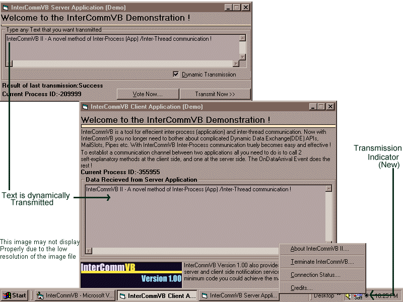



## Easy COM based Multichannel Dynamic Data Exchange \(DDE\) Between Apps \- With InterCommVB II \(Updated\)

### Description

Learn a new method of dynamically exchanging data between apps - with InterCommVB II. With unparalled power and ease of use, InterCommVB truly allows you to get the max output from minimum code. So you no longer need to tamper around with DDE APIs and other hard Win32 APIs. InterCommVB truely makes implementing DDE a breeze - even a beginner could be implementing DDE with this component. The package also includes an HTML file to help you understand the concepts better, in case you are a newbie ! This version is updated to include a host of new features !
 
### More Info
 

             |
---                |---
**Submitted On**   |2002-06-25 20:15:30
**By**             |[Srideep Prasad](https://github.com/Planet-Source-Code/PSCIndex/blob/master/ByAuthor/srideep-prasad.md)
**Level**          |Advanced
**User Rating**    |5.0 (659 globes from 132 users)
**Compatibility**  |VB 5\.0, VB 6\.0
**Category**       |[OLE/ COM/ DCOM/ Active\-X](https://github.com/Planet-Source-Code/PSCIndex/blob/master/ByCategory/ole-com-dcom-active-x__1-29.md)
**World**          |[Visual Basic](https://github.com/Planet-Source-Code/PSCIndex/blob/master/ByWorld/visual-basic.md)
**Archive File**   |[Easy\_COM\_b985726252002\.zip](https://github.com/Planet-Source-Code/srideep-prasad-easy-com-based-multichannel-dynamic-data-exchange-dde-between-apps-with-int__1-25759/archive/master.zip)

### Source Code

<html>
<head>
<meta http-equiv="Content-Type" content="text/html; charset=windows-1252">
<meta name="GENERATOR" content="Microsoft FrontPage 4.0">
<meta name="ProgId" content="FrontPage.Editor.Document">
<title>What is Interprocess Communnication</title>
</head>
<body>

<b><u>What is Interprocess Communnication(IPC)</u></b>

IPC is a technology that enables two or more running apps to exchange data
dynamically with each other

<b><u>InterProcess Communication - The Problems 
</u></b>Microsoft Windows comes with a variety of ways to implement Inter Process Communication (IPC). Notable among these are the Dynamic Data Exchange (DDE) APIs, Mailslots and Pipes. 

 
DDE allows applications to communicate with each other dynamically. But implementing DDE is no easy job - the DDE APIs tend to be highly complicated and difficult to implement, especially for the VB programmer.   
MailSlots and Pipes are basically technologies wherein virtual temp files are created in the RAM and can be used by apps to store shareable data. This technique does not tend to be straightforward either and these methods by itself do not provide notification mechanisms ! 
Of course, you could use temp files, but this method is cumbersome and slow... Then how do we implement Inter Process Communication (IPC) ? Simple - We harness the potential of Microsoft's powerful COM based ActiveX Technology ! 

<b>
Easy and Efficient Interprocess Communication (IPC) with InterCommVB 1.00 
</b>
InterCommVB allows developers to implement IPC very easily. With just a few easy to understand calls to this component from the client and server sides, one can efficiently implement easy and effective interprocess communication 
What's more - InterCommVB allows multiple data communication channels to be open and for one channel say if App A is the Server App and if App B is the Client then for another channel App A could act as the Client and App B could act as the server ! That's truly two way communication ! And of course,
<b> this ActiveX EXE comes with an inbuilt notification system that notifies both the server and client sides of the data transmission status ! What's more - this component is multithreaded, that is if one communication channel is blocked or busy, other channels remain unaffected. And the component now implements real time asynchronous communication, so no more worries about the server app getting "stuck" waiting for the client app to process transmitted data.
This component now also defines an updated internal error handling interface...</b> 
<b><u><a href="http://www.planet-source-code.com/vb/scripts/voting/VoteOnCodeRating.asp?lngWId=1&txtCodeId=25759&optCodeRatingValue=5"> IF YOU FIND IT USEFUL, PLEASE VOTE. THANK YOU !</a></u></b><a href="http://www.planet-source-code.com/vb/scripts/voting/VoteOnCodeRating.asp?lngWId=1&txtCodeId=25759&optCodeRatingValue=5"> 
</a>
 
            
 
 

</body>
</html>

